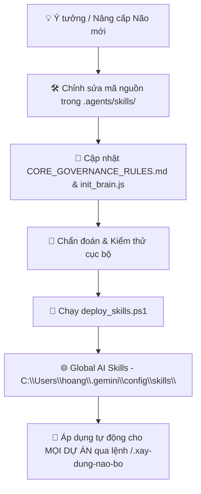

# 🧠 BRAIN4AGENT (v1.2.2) — TRUNG TÂM QUẢN TRỊ & NÂNG CẤP NÃO BỘ (BRAIN GOVERNANCE HUB)

Dự án này (**brain4agent v1.2.2**) là **Tổng Hành Dinh Quản Lý & Nâng Cấp Não Bộ (Single Source of Truth for Brain Development & AI Governance)**. Mọi nghiên cứu, tối ưu thuật toán, nâng cấp luật vận hành và phát triển bộ skill lõi (`.xay-dung-nao-bo`, `.compact`) được hoàn thiện tập trung tại kho chuẩn `.agents/skills/` trước khi deploy ra toàn bộ hệ sinh thái.

---

## 🎯 1. VAI TRÒ VÀ TRÁCH NHIỆM CỦA BRAIN4AGENT

1. **Vườn Ươm Kiến Trúc Não Bộ (Architecture Incubator):**
   - Nghiên cứu và hoàn thiện mô hình bộ nhớ AI Đa Tầng (Multi-Tier Hot/Cold Memory Architecture).
   - Tối ưu hóa dung lượng token và tốc độ phục hồi ngữ cảnh của Agent qua Hot Memory (`today.md` & `state.json`).
2. **Quản Lý & Phát Triển Bộ Hiến Pháp Vận Hành (`CORE_GOVERNANCE_RULES.md`):**
   - Nơi lưu trữ, cập nhật và tinh chỉnh các quy tắc quản trị bất biến (Startup Protocol Bước 0, Spec-First Planning, Model Tiering 🔴/🟠/🟢, Ma trận Đồng bộ 6 điểm, Single Skill Vault, Root Clean 100%...).
3. **Mã Nguồn Gốc Của Bộ Kỹ Năng Não Bộ Chuẩn Toàn Cầu ([`.agents/skills/`](file:///D:/Data/Repositories/.My-Repositories/brain4agent.old/.agents/skills)):**
   - Thư mục [`.agents/skills/.xay-dung-nao-bo/`](file:///D:/Data/Repositories/.My-Repositories/brain4agent.old/.agents/skills/.xay-dung-nao-bo) là source code gốc của Universal Brain Engine (tự chẩn đoán, khởi tạo hoặc migration 1-click).
   - Thư mục [`.agents/skills/.compact/`](file:///D:/Data/Repositories/.My-Repositories/brain4agent.old/.agents/skills/.compact) là source code gốc của Skill nén ngữ cảnh đa tầng bảo đảm Root Clean 100%.
4. **Triển Khai Đồng Bộ Ra Toàn Bộ Hệ Thống (Auto-Deployment):**
   - Cung cấp script tự động deploy mã nguồn skill mới nhất từ `.agents/skills/` sang thư mục Global Config của AI (`C:\Users\hoang\.gemini\config\skills\`).

---

## 🚀 2. QUY TRÌNH PHÁT TRIỂN & TRIỂN KHAI NÃO BỘ (WORKFLOW)



### Lệnh Vận Hành & Triển Khai Nhanh:
```powershell
# Chạy chẩn đoán bộ não
npm run init-brain

# Triển khai sang Global AI Skills
npm run deploy
```

---

## 📁 3. CẤU TRÚC THƯ MỤC DỰ ÁN

```text
brain4agent/
├── package.json                      # [VERSION TRUTH] Phiên bản v1.2.2
├── AGENTS.md                         # [QUY TẮC TỐI THƯỢNG] Nguồn chân lý DUY NHẤT (Gemini/Codex đọc trực tiếp)
├── CLAUDE.md                         # [SHIM] Điểm nạp tự động của Claude Code — chỉ chứa @AGENTS.md
├── brain4agent-v1.2.0.md             # [MARKER] Phiên bản khung não — soi nhanh ở root
├── README.md                         # [TỔNG QUAN] Bản đồ trung tâm quản lý và hướng dẫn vận hành
├── CORE_GOVERNANCE_RULES.md          # [HIẾN PHÁP CHUẨN] Bộ luật vận hành bất biến toàn diện
├── brain4agent/                      # [BỘ NHỚ WORKSPACE] Single Source of Truth của Hub
│   ├── memory/hot/                   # [HOT MEMORY] Ký ức nóng phiên (today.md, state.json)
│   ├── memory-distill.txt            # [KERNEL] Bản cô đọng tối thượng (< 100 dòng)
│   ├── index.md                      # [ROUTER] Master Index Map & Codebase Navigation
│   ├── roadmap.md                    # [ROADMAP] Tiến độ, Active tasks & Idea Vault
│   ├── changelog.md                  # [CHANGELOG] Lịch sử Semantic Releases
│   ├── -known-gotchas.md             # [GOTCHAS] Tổng hợp lỗi dị biệt & bẫy kỹ thuật
│   ├── -data-architecture.md         # [DATA ARCH] Kiến trúc dữ liệu & Data Flow
│   └── project-intro.md              # [INTRO] Tổng quan Hub & Tech stack
├── planning/                         # [QUẢN LÝ KẾ HOẠCH] Chứa các bản kế hoạch RFCs
│   ├── 01_2026-08-28_modernize-hub-v52/
│   ├── 02_2026-08-31_dual-entry-point-claude-shim/
│   ├── 03_2026-08-31_brain-version-marker/
│   ├── 04_2026-08-31_rollout-ecosystem/
│   └── 05_2026-08-31_nao-hoa-nhom-c/   # + specs/ (Spec-First: 00-ARCHITECTURE, 01-CONTRACTS, SPEC-P01..P06)
├── .agents/skills/                   # [SINGLE SKILL VAULT] Kho kỹ năng chuẩn hóa 100%
│   ├── .xay-dung-nao-bo/             # Universal Brain Engine
│   │   ├── SKILL.md
│   │   └── scripts/init_brain.js
│   └── .compact/                     # Skill nén ngữ cảnh đa tầng
│       └── SKILL.md
├── archive/                          # [LƯU TRỮ LỊCH SỬ] Các phiên bản cũ để tra cứu
│   └── legacy-skills/                # (.brain-build, .update-brain)
├── docs/                             # [MODULE DOCS] Tài liệu kỹ thuật chi tiết
│   ├── BRAIN_ARCHITECTURE_GUIDE.md
│   └── MODULE_DOCUMENTATION_SPEC.md
└── scripts/
    └── deploy_skills.ps1             # [DEPLOY SCRIPT] Script đồng bộ an toàn sang Global AI Skills
```
