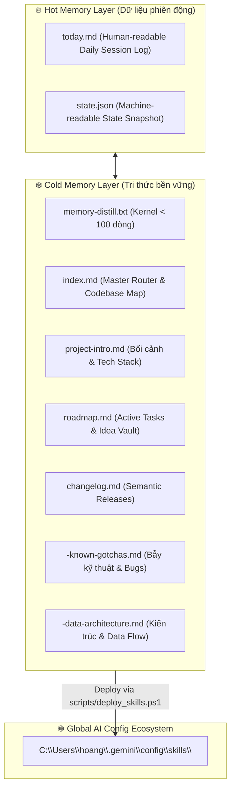

# Master Data Architecture & Flow

Tài liệu thiết kế về cấu trúc phân vùng dữ liệu, cơ chế lưu trữ bền vững (Persistence Layer) và luồng luân chuyển tri thức của Brain Governance Hub.

---

## 1. Cấu Trúc Bộ Nhớ Đa Tầng (Multi-Tier Memory Stores)

---

## 2. Luồng Luân Chuyển Dữ Liệu Khi Deploy (Data Flow)

1. **Hub Source Files:**
   - `.xay-dung-nao-bo/` (SKILL.md, scripts/init_brain.js)
   - `.compact/` (SKILL.md)
2. **Safety Validation Gate:** Script `deploy_skills.ps1` kiểm tra tính nguyên vẹn của source code (không có nested duplicate, syntax hợp lệ).
3. **Deployment Target:** Sao chép nguyên khối sang `C:\Users\hoang\.gemini\config\skills\.xay-dung-nao-bo` và `.compact`.
4. **All Projects Execution:** Mọi dự án khác khi gọi `node C:\Users\hoang\.gemini\config\skills\.xay-dung-nao-bo\scripts\init_brain.js` sẽ tự động nhận được các luật vận hành mới nhất từ Hub!
