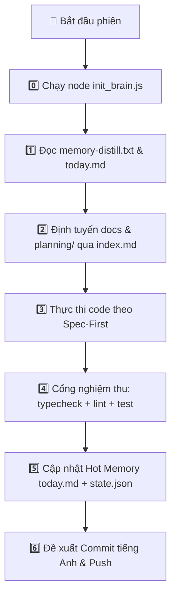

# 🤖 CẨM NANG TOÀN DIỆN TỪ A-Z DÀNH CHO AI AGENT (UNIVERSAL ZERO-CONFIG AGENT GUIDE)

> **Mục đích:** Tài liệu này là kim chỉ nam độc lập giúp **bất kỳ AI Agent nào** (Claude Code, OpenAI Codex, Cursor, Windsurf, Google Antigravity, Gemini CLI...) khi nhận được yêu cầu xử lý/tái cấu trúc một dự án đều có thể tự động thực thi trơn tru từ A đến Z mà **không cần người dùng phải cấu hình thủ công**.

---

## ⚡ 1. QUY TRÌNH 1-CLICK: TÁI CẤU TRÚC / KHỞI TẠO NÃO BỘ (ZERO-CONFIG BOOTSTRAP)

Khi người dùng yêu cầu: *"Xây dựng não bộ"*, *"Tái cấu trúc theo chuẩn brain4agent"*, hoặc *"Khởi tạo dự án"*:

### 📌 Lệnh Thực Thi Duy Nhất (Chạy Tại Root Dự Án Đích):
```bash
# Cách 1: Sử dụng bộ Universal Engine đã deploy trên máy
node "C:/Users/hoang/.gemini/config/skills/.xay-dung-nao-bo/scripts/init_brain.js"

# Cách 2: Nếu chỉ định đường dẫn dự án đích từ bất kỳ đâu
node "C:/Users/hoang/.gemini/config/skills/.xay-dung-nao-bo/scripts/init_brain.js" "/duong/dan/toi/du_an_dich"
```

### 🧠 Cơ Chế Tự Động Xử Lý Của Script:
1. **Dự án mới tinh:** Tự động sinh trọn bộ `brain4agent/` (7 phân vùng cố định + `memory/hot/`), `AGENTS.md` (chuẩn V5.2), `planning/` và `.agents/skills/`.
2. **Dự án cũ / lệch chuẩn:** Tự động phát hiện và di dời `latest_memory.md` ngoài root vào `brain4agent/memory/hot/today.md` & `state.json`, đổi tên `Plan/` $\rightarrow$ `planning/`, `DOCS/` $\rightarrow$ `docs/`, vá Bước 0 vào `AGENTS.md` **(bảo tồn 100% dữ liệu gốc)**.
3. **Dự án đã chuẩn:** Báo trạng thái `NÃO ĐÃ OK — KHÔNG CẦN NÂNG CẤP THÊM`.

---

## 📝 2. NHIỆM VỤ CỦA AGENT SAU KHI SCRIPT CHẠY XONG (POST-BOOT ACTIONS)

Ngay sau khi script hoàn thành, Agent **bắt buộc** đọc mã nguồn dự án thực tế và cập nhật 3 vị trí sau:

### 1. Điền thông tin vào `brain4agent/project-intro.md`:
- **Mục tiêu nghiệp vụ:** Dự án này làm gì? Giải quyết bài toán nào?
- **Tech Stack:** Frontend, Backend, Database, Runtime, Frameworks chính.

### 2. Điền thông tin vào `brain4agent/memory-distill.txt` (< 100 dòng):
- Cập nhật mục `<project_foundation>` với Tech stack và cơ chế Data persistence thực tế.

### 3. Cập nhật bản đồ cây thư mục trong `brain4agent/index.md`:
- Cập nhật mục `2. Bản Đồ Cấu Trúc Mã Nguồn (Codebase Directory Map)` khớp chính xác với các thư mục thực tế của dự án.

---

## 🔄 3. VÒNG ĐỜI LÀM VIỆC THEO PHIÊN (SESSION WORKFLOW FROM A TO Z)



### Chi Tiết Từng Bước:

#### 🟢 Bắt Đầu Phiên:
1. **Bước 0:** Chạy `node C:/Users/hoang/.gemini/config/skills/.xay-dung-nao-bo/scripts/init_brain.js`.
2. **Bước 1:** Đọc `brain4agent/memory-distill.txt` để nắm kernel và đọc `brain4agent/memory/hot/today.md` để khôi phục ngữ cảnh phiên trước.
3. **Bước 2:** Đọc `brain4agent/index.md` để xác định tài liệu chuyên trách trong `docs/<module>.md` hoặc kế hoạch active trong `planning/`.

#### 🟠 Trong Lúc Code (Spec-First & Model Tiering):
- Tạo kế hoạch trong thư mục `planning/[STT]_[YYYY-MM-DD]_[Ten-Ngan]/plan.md`.
- Gắn thẻ phân tầng: 🔴 (Opus/Claude 3.7 - Kiến trúc), 🟠 (Sonnet - Code tính năng/test), 🟢 (Haiku - Viết docs/format).
- Nhúng trực tiếp checklist vào `plan.md`, check `[x]` tại chỗ (CẤM file nháp ngoài root).

#### 🔵 Kết Thúc Phiên (Đóng Phiên & Nén Ngữ Cảnh):
1. **Ghi nhật ký phiên:** Cập nhật `brain4agent/memory/hot/today.md` (thành tựu, benchmark, file đã sửa).
2. **Cập nhật máy trạng thái:** Ghi `brain4agent/memory/hot/state.json` (version, last verification).
3. **Đồng bộ phân vùng:** Nếu có bug khó $\rightarrow$ `-known-gotchas.md`; ý tưởng mới $\rightarrow$ `roadmap.md` (Idea Vault); quyết định lớn $\rightarrow$ `changelog.md`.
4. **Giữ Root sạch 100%:** Tuyệt đối không tạo `latest_memory.md` ngoài root.
5. **Git Commit:** Dùng bảng hỏi Tiếng Việt (`ask_question`), soạn commit message 100% Tiếng Anh theo chuẩn Conventional Commits (`feat(scope): ...`, `fix(scope): ...`).
