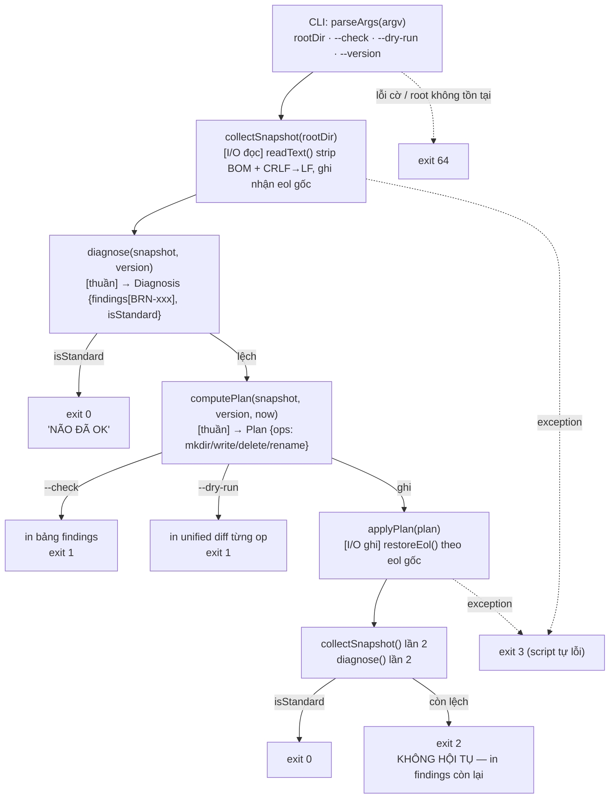
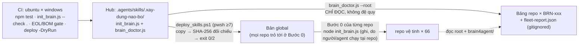

# 00-ARCHITECTURE — Kiến Trúc Đợt "Engine Có Kiểm Chứng" (#09)

## 1. Vấn đề

Hub hiện có **một engine 772 dòng** (`.agents/skills/.xay-dung-nao-bo/scripts/init_brain.js`) vá `AGENTS.md`, `CLAUDE.md`, `brain4agent/`, marker và `state.json` của **toàn bộ hệ sinh thái** (66/67 repo đang ở chuẩn `1.3.0`), cộng **một script deploy 84 dòng** (`scripts/deploy_skills.ps1`) chép engine ra bản global mà mọi repo trỏ tới ở Bước 0. Cả hai:

- **Không có mã thoát thật.** Engine kết thúc bằng `process.exit(0)` ở nhánh "đã chuẩn" (dòng 124) và rơi xuống cuối file (dòng 770–772) ở nhánh ghi — mọi lỗi giữa chừng chỉ `console.error` (dòng 148, 163, 415, 437) rồi đi tiếp. Script deploy không có `$ErrorActionPreference`, hai lệnh `Copy-Item` (dòng 38, 43) không `-ErrorAction Stop` ⇒ lỗi non-terminating lọt qua `try/catch` (dòng 28–84) và banner "HOÀN TẤT THÀNH CÔNG" (dòng 79) vẫn in. Đây đúng lớp lỗi gotcha #15.
- **Không có một dòng test nào.** 0 `module.exports`, 0 khai báo hàm; toàn bộ là mã cấp module chạy ngay khi `require` (D2). Ba bug lịch sử của engine (regex `\n` trượt trên CRLF — #07; fallback Bước 0 no-op — v1.2.2; bản global kẹt `1.2.0` — gotcha #12) đều do **người** phát hiện sau khi đã lan ra hệ sinh thái.
- **Đọc file ngây thơ.** `readFileSync(..., 'utf8')` không strip BOM ⇒ `JSON.parse` ném lỗi (dòng 399) → `catch` (dòng 414) chỉ log ⇒ `brain_template_version` **không bao giờ hội tụ** trên file có BOM (D4). Bản deploy file lệnh Claude Code hiện đang **có BOM** vì `package.json` gọi `powershell` 5.1 (D5).
- **Chẩn đoán là danh sách boolean thủ công** (dòng 109): không kiểm `state.json.brain_template_version` (nguồn chân lý máy đọc), không đếm số lần xuất hiện, không kiểm `CLAUDE.md` ≤ 10 dòng (D7). Đã sót 3 lần.
- **Không có công cụ đo độ lệch hệ sinh thái.** Mỗi phiên lại viết một script PowerShell tạm; #04/#06/#07 đều ghi nhận script kiểm kê ngây thơ cho số sai (7 cái bẫy — brief mục E).

## 2. Mục tiêu (Goals)

| # | Mục tiêu | Đo bằng |
| :-- | :--- | :--- |
| G1 | Engine trả **mã thoát có nghĩa** và có 3 chế độ: ghi (mặc định), `--check` (chỉ đọc), `--dry-run` (in diff, không ghi) | Bảng mã thoát 01-CONTRACTS §6 — mỗi dòng có ≥1 test |
| G2 | Engine **test được** bằng `node:test`, 0 dependency, `npm test` xanh trên Windows và Linux | `tests/` + CI matrix |
| G3 | Hành vi ghi của engine **byte-identical** với v1.5.4 trên bộ golden (trừ các ca khiếm khuyết cố ý sửa: D3, D4) | `tests/golden/manifest.json` |
| G4 | Deploy **fail-closed**: bất kỳ lỗi nào ⇒ exit ≠ 0, không in banner thành công; sau deploy tự đối chiếu SHA-256 nguồn↔đích | SPEC-P03 §D |
| G5 | Có `brain-doctor` quét **chỉ đọc** toàn hệ sinh thái, in bảng + `fleet-report.json`, mã thoát phân tầng, **không quét đệ quy** | SPEC-P04 §D: ≤ 40 s cho ~70 thư mục |
| G6 | Hàng rào tự động thay kỷ luật thủ công: `.gitattributes`, 0 CRLF/BOM lọt vào index, CI chạy test + self-check | SPEC-P05 |

## 3. Non-goals — 8 VÙNG CẤM của đợt này (đã cân nhắc và quyết định KHÔNG làm)

Bê nguyên từ scope brief mục G. Agent thực thi **CẤM** "tiện tay làm luôn" bất kỳ mục nào dưới đây.

| # | KHÔNG làm | Lý do |
| :-- | :--- | :--- |
| NG1 | **KHÔNG** chuyển cơ chế vá từ regex sang khối đánh dấu ẩn (`<!-- brain:rule -->`) | Đó là thay đổi ĐÚNG về lâu dài, nhưng bắt buộc phải có lưới an toàn (WP2) TRƯỚC, và nó kéo theo một đợt ghi vào 66 repo. Ghi hàng loạt bị cấm ở đợt này. ⇒ **Kế hoạch #10.** |
| NG2 | **KHÔNG** viết lại engine bằng TypeScript, **KHÔNG** thêm build step | Engine phải chạy được bằng `node <file>` từ bất kỳ đâu, kể cả bản copy global. Build step = thêm một tầng "bản deploy kẹt version cũ" (gotcha #12). |
| NG3 | **KHÔNG** dùng Jest/Vitest | Kéo hàng chục dependency trong khi `node:test` (v24.15.0) đã có `describe/it/mock/snapshot/assert`. |
| NG4 | **KHÔNG** tự động chạy engine ghi hàng loạt 67 repo qua CI/cron | Engine ghi vào repo có việc dang dở của chủ dự án — bài học đã có thật (#06 §7: 8 repo phải stage tường minh). Quét (`--check`, doctor) tự động được; **ghi** phải có người bấm nút. |
| NG5 | **KHÔNG** xây web dashboard / database cho báo cáo độ lệch | JSON + bảng terminal đủ cho 67 repo. |
| NG6 | **KHÔNG** migrate các gói `planning/` cũ dạng phẳng sang `specs/` | Luật `AGENTS.md` §3 mục 2.6 đã cấm (Path Invariant). |
| NG7 | **KHÔNG** nhét luật vào `CLAUDE.md` | Luật J — Dual Entry-Point Invariant. Đợt này còn thêm mã kiểm `BRN-005` để **chặn** việc đó. |
| NG8 | **KHÔNG** gộp/xoá `CORE_GOVERNANCE_RULES.md` | Hub đang có **2 file hiến pháp song song** (`AGENTS.md` 149 dòng luật A–J; `CORE_GOVERNANCE_RULES.md` 158 dòng LUẬT 1–9), gần như song ánh, phải sửa tay đồng thời — mâu thuẫn với tuyên bố "nguồn chân lý DUY NHẤT". Hiện **chưa lệch** (3 token `SPEC PACKAGE`/`OPERATIONS.md`/`TESTING-ACCEPTANCE` đều khớp). Đợt này chỉ **thêm 1 ca test tự động phát hiện khi 2 file lệch** (SPEC-P02 §B, ca `T-H02`); hợp nhất để kế hoạch sau. |

Ngoài 8 vùng cấm trên, mỗi SPEC-Pxx còn có **vùng cấm riêng** của gói đó (mục (b) của từng SPEC).

## 4. Bất biến kiến trúc (không SPEC nào được vượt)

| ID | Bất biến | Kiểm bằng |
| :-- | :--- | :--- |
| A1 | **0 dependency runtime, 0 devDependency.** `package.json` không có `dependencies`/`devDependencies`. Test chỉ dùng `node:test`, `node:assert`, `node:fs`, `node:path`, `node:child_process`, `node:os`, `node:crypto`. | Test `T-A01` đọc `package.json` |
| A2 | **Một file, chạy được từ bất kỳ đâu.** `node <đường-dẫn-bất-kỳ>/init_brain.js [root]` và `node .../brain_doctor.js` hoạt động không cần `node_modules`, không cần `package.json` bên cạnh. `brain_doctor.js` chỉ `require('./init_brain.js')` bằng đường dẫn tương đối cùng thư mục. | Test chạy engine từ bản copy ở thư mục tạm |
| A3 | **Lõi thuần — vỏ mỏng.** Mọi quyết định "cần vá gì / nội dung sau vá là gì" nằm trong hàm thuần (chuỗi/đối tượng → chuỗi/đối tượng, không `fs`, không `Date.now()`, không `console`). I/O chỉ ở `collectSnapshot()` (đọc) và `applyPlan()` (ghi). | Test unit gọi hàm thuần không chạm đĩa; grep `fs.` chỉ xuất hiện trong 2 hàm I/O + CLI |
| A4 | **`require()` không có tác dụng phụ.** `require('./init_brain.js')` không in, không ghi, không `process.exit`. CLI chỉ chạy dưới `require.main === module`. | Test `T-P06-01` |
| A5 | **Fail-closed ở mọi cổng.** Lỗi ⇒ exit ≠ 0 ⇒ không in banner thành công. Không có nhánh "log cảnh báo rồi coi như xong". | Bảng mã thoát + test từng dòng |
| A6 | **Chỉ đọc theo mặc định ở quy mô hệ sinh thái.** `brain-doctor` không có chế độ ghi. Engine ghi chỉ trên **một** root truyền vào. | Grep `writeFileSync`/`unlinkSync`/`renameSync` trong `brain_doctor.js` = 0 |
| A7 | **Chuẩn hoá-khi-đọc, giữ EOL gốc khi ghi.** Hợp đồng 01-CONTRACTS §1. Không có chỗ nào gọi `fs.readFileSync(p, 'utf8')` trực tiếp ngoài `readText()`. | Grep |
| A8 | **`BRAIN_TEMPLATE_VERSION` = `1.3.0` không đổi.** Không sửa bất kỳ template/nội dung vá nào (dòng 188–343, 443–455, 469–618, 632, 641, 658–665, 682–699, 745–753). | Test golden + diff nội dung template |
| A9 | **PUBLIC hygiene.** Không file nào mới commit chứa đường dẫn tuyệt đối máy user, tên repo vệ tinh, vị trí secret. `fleet-report*.json` bị `.gitignore`. Fixture dùng tên chung (`repo-alpha`…). | Test `T-A09` grep regex trên `git ls-files` |
| A10 | **Byte-identical trên golden.** Với mọi fixture golden (LF, không BOM, không mẫu `$` đặc biệt), cây output sau refactor có SHA-256 từng file **bằng** manifest sinh từ engine v1.5.4. | `tests/golden.test.js` |
| A11 | **Không ghi hàng loạt.** Đợt này không có bước nào chạy engine ở chế độ ghi trên repo ngoài hub và fixture. | OPERATIONS §4 |

## 5. Sơ đồ luồng

### 5.1. Engine sau refactor (WP6 + WP1)

### 5.2. Hệ sinh thái: nguồn → deploy → global → repo vệ tinh, và vòng đo ngược của doctor

## 6. Router thứ tự đọc

1. `00-ARCHITECTURE.md` (file này) — mục tiêu, vùng cấm, bất biến.
2. `01-CONTRACTS.md` — **đọc trọn** trước khi viết code; mọi chữ ký/mã thoát/schema lấy từ đây, SPEC-Pxx chỉ tham chiếu, không định nghĩa lại.
3. `OPERATIONS.md` §1 — thứ tự bắt buộc giữa các WP (không phải thứ tự số SPEC).
4. SPEC theo thứ tự thực thi: `SPEC-P05` §A → `SPEC-P02` §A → `SPEC-P06` → `SPEC-P01` → `SPEC-P02` §B → `SPEC-P05` §B → `SPEC-P03` → `SPEC-P04`.
5. `TESTING-ACCEPTANCE.md` — khi viết test và khi đóng.

## 7. Mô hình rủi ro và đối sách

| Rủi ro | Đối sách |
| :--- | :--- |
| Refactor làm đổi hành vi ghi ⇒ 66 repo nhận diff lạ ở lần Bước 0 kế tiếp | Golden chụp từ engine v1.5.4 **trước** refactor (WP2a trước WP6); gate byte-identical; deploy global chỉ sau khi golden xanh |
| Fixture CRLF/BOM/UTF-16 bị git chuẩn hoá mất | `.gitattributes` có `tests/fixtures/** -text` **trước** khi tạo fixture (WP5a trước WP2a) |
| `brain-doctor` treo trên kho ~70 repo | Cấm đệ quy; timeout 5 s cho mỗi lệnh git; `--no-git`; ngân sách ≤ 40 s đo thật |
| Report/fixture lộ tên repo vệ tinh hoặc đường dẫn máy user (gotcha #14) | `fleet-report*.json` gitignored; test `T-A09` grep regex cấm; fixture tên chung |
| Cổng chỉ in cảnh báo (gotcha #15) tái diễn trong CI/deploy | Mọi cổng là lệnh riêng trả exit ≠ 0; CI không nối `&&` giữa cổng `echo` và bước sau |
| Bản deploy global kẹt cũ (gotcha #12) | Deploy tự so SHA-256; `-VerifyOnly` để kiểm bất kỳ lúc nào; doctor có `--expect-template` |
| Sửa D3/D4 vô tình đổi output trên file bình thường | Golden corpus không chứa BOM/`$` đặc biệt ⇒ mọi khác biệt trên golden là regression, không phải "fix" |
