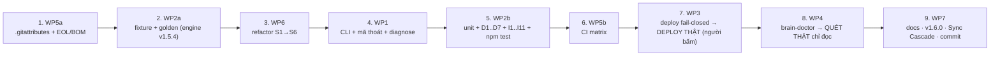

# OPERATIONS — Thứ Tự Thực Thi, Deploy, Runbook Rollback, Việc Cần Người Bấm Nút (#09)

---

## §1. THỨ TỰ BẮT BUỘC GIỮA CÁC WP (không phải thứ tự số SPEC)

| Bước | WP | Vì sao phải đứng ở đây (không đổi được) |
| :-- | :--- | :--- |
| 1 | WP5a | Fixture CRLF/BOM/UTF-16 (bước 2) phải được commit **nguyên byte**; với `core.autocrlf=true` mà chưa có `tests/fixtures/** -text`, `git add` sẽ chuẩn hoá thành LF ⇒ fixture mất tác dụng ngay từ commit đầu. Đồng thời dọn 2 file (BOM + byte điều khiển) để cổng EOL/BOM của CI có xuất phát điểm sạch. |
| 2 | WP2a | Golden phải sinh từ engine **v1.5.4 nguyên bản**. Refactor trước rồi mới chụp = tự chấm bài mình (A10 vô nghĩa). |
| 3 | WP6 | Cần golden làm gate cho từng bước S1–S6. Là điều kiện cần của WP1 (cần `computePlan` để `--dry-run`) và WP2b (cần hàm thuần để unit test). |
| 4 | WP1 | Cần lõi thuần từ WP6. Phải xong trước WP2b vì bảng mã thoát và `diagnose()` đầy đủ là đối tượng test. Phải xong trước WP4 vì doctor gọi `diagnose()`. |
| 5 | WP2b | Cần WP1 (mã thoát, BRN đầy đủ). Phải xong trước CI (bước 6) — CI không có gì để chạy nếu chưa có test. |
| 6 | WP5b | Cần `npm test` tồn tại. Đứng trước deploy để mọi commit engine từ đây trở đi được CI kiểm trên 2 OS trước khi ra global. |
| 7 | WP3 | Deploy engine mới ra global **chỉ sau** khi test + CI xanh (nếu không là lặp gotcha #12 theo chiều ngược: đẩy bản lỗi ra 66 repo). Là bước đầu tiên **chạm máy user ngoài repo hub** ⇒ người bấm nút. |
| 8 | WP4 | Doctor cần `require('./init_brain.js')` không tác dụng phụ (WP6) + `diagnose()` đủ mã (WP1). Quét thật để nghiệm thu phải chạy **bản đã deploy** (WP3) từ global — chứng minh A2. |
| 9 | WP7 | Đóng: chỉ khi mọi gate ✅. Bump version một lần. |

**Cấm chạy song song:** các WP dùng chung `init_brain.js` (WP6, WP1) và `tests/` (WP2a, WP2b) — tuần tự tuyệt đối. Có thể song song: WP5b (file yml) với WP3 (file ps1) sau bước 5, nếu 2 agent khác nhau và không đụng file chung.

## §2. TIỀN KIỂM ĐẦU MỖI PHIÊN LÀM VIỆC (bài học #07 — phiên khác có thể đã đổi engine)

1. `git -C <hub> status` sạch; `git log -3 --format='%h %s'` — xem có commit nào đổi `BRAIN_TEMPLATE_VERSION` không (`git diff HEAD~3 -- .agents/skills/.xay-dung-nao-bo/scripts/init_brain.js | grep BRAIN_TEMPLATE_VERSION` phải rỗng). Nếu đã đổi ⇒ **DỪNG**, kế hoạch này giả định `1.3.0`.
2. `node --version` = `v24.15.0` (hoặc ≥ 24); `pwsh --version` ≥ 7; `git --version`.
3. Từ bước 3 trở đi: `npm run test:golden` xanh trước khi sửa bất kỳ dòng nào của engine.
4. Từ bước 7 trở đi: `npm run deploy:verify` — ghi mã thoát vào `today.md` (trước WP3 xong: kỳ vọng 2 vì global còn bản cũ; sau: 0).

## §3. QUY TRÌNH DEPLOY (WP3 → global) — **người bấm nút**

| # | Việc | Lệnh / kiểm | Ai |
| :-- | :--- | :--- | :-- |
| D1 | Điều kiện: `npm test` xanh local; CI xanh 2 OS ở commit HEAD; `git status` sạch | | agent |
| D2 | **Backup bản global** hiện tại | copy toàn bộ thư mục skill global + thư mục lệnh Claude Code vào `scratchpad/backup-global-<yyyymmdd-hhmmss>/`; ghi đường dẫn backup vào `today.md` (**không** ghi vào SPEC — đường dẫn máy user) | agent |
| D3 | Ghi nhận hash TRƯỚC | `npm run deploy:verify` ⇒ kỳ vọng exit 2, bảng có `DIFF init_brain.js`, `MISSING brain_doctor.js`; dán `SUMMARY` vào TESTING-ACCEPTANCE | agent |
| D4 | **Xin phép user** bằng lời (không thẻ): "sắp ghi vào thư mục global của máy, ảnh hưởng Bước 0 của mọi repo" | | **user** |
| D5 | Deploy | `npm run deploy` ⇒ kỳ vọng exit 0, `SUMMARY diff=0 missing=0 cmd=ok` | agent |
| D6 | Kiểm độc lập (không tin script) | `Get-FileHash` tay từng file nguồn vs đích; `od -An -tx1 -N3` file lệnh ≠ `ef bb bf` | agent |
| D7 | Kiểm chức năng từ global | `node <global>/init_brain.js --version` ⇒ `brain-engine 1.6.0 template 1.3.0`; `node <global>/init_brain.js --check <hub>` ⇒ 0 + `NÃO ĐÃ OK` | agent |
| D8 | Ghi `today.md` + `state.json` (`engine_source_vs_global_deploy: hash-identical`, hub 1.6.0) | | agent |

**Thứ tự deploy so với bump version:** deploy ở bước 7 mang `ENGINE_VERSION='1.6.0'` trong khi `package.json` còn `1.5.4`? **Không** — quyết định: bump `ENGINE_VERSION` + `package.json` + `state.json.current_version` lên `1.6.0` **ngay trước D1** trong cùng nhánh (test `version-sync` bắt buộc khớp), commit; deploy; các bước 8–9 không đổi version nữa. Phát hành `v1.6.0` chính thức (changelog) vẫn ở bước 9.

## §4. LUẬT VẬN HÀNH XUYÊN SUỐT

- **KHÔNG `git push`** trong bất kỳ WP nào; đề xuất commit local bằng lời (luật §5.D) — riêng push chờ user ra lệnh (thao tác remote).
- **KHÔNG chạy engine chế độ ghi** ngoài: hub (bước 9 nếu cần), fixture/tmp. Không vòng lặp trên kho (NG4, A11).
- **KHÔNG ghi tên repo vệ tinh, đường dẫn máy user** vào bất kỳ file nào trong hub. Kết quả doctor thật: **chỉ số đếm** vào TESTING-ACCEPTANCE; `fleet-report.json` để ở scratchpad.
- Mỗi WP một hoặc vài commit **tiếng Anh, Conventional Commits**; không trộn WP trong một commit (để revert được theo WP — §5).
- Cổng nào chỉ `echo` mà không `exit` ≠ 0 là **vi phạm** (gotcha #15). Trong shell: `[ $bad -eq 0 ] || exit 1`.

## §5. RUNBOOK ROLLBACK TỪNG WP

Nguyên tắc chung: mọi WP đều commit riêng ⇒ rollback = `git revert <sha…>` (không `reset --hard` trên nhánh có việc của người khác). Chỉ WP3 có **trạng thái ngoài git** (thư mục global) — rollback riêng.

### WP5a — `.gitattributes` + EOL/BOM
1. `git revert <sha-gitattributes> <sha-control-bytes>` (2 commit).
2. Cây làm việc: `git ls-files --eol` — sau revert, `core.autocrlf=true` lại quyết định; **không** làm gì thêm.
3. Ảnh hưởng ngoài hub: **không**. Tác dụng phụ: fixture đã commit (nếu có) sẽ **mất byte gốc** ở checkout sau ⇒ nếu revert WP5a thì phải revert luôn WP2a.

### WP2a — fixture + golden
1. `git revert <sha-tests>`; xoá `tests/.tmp/` nếu có.
2. Ảnh hưởng runtime: **không** (engine không đọc `tests/`).
3. Nếu chỉ cần chụp lại golden (không rollback): **cấm** trừ khi có quyết định trong `plan.md`; chụp bằng `git show <engine_commit>:<path> > scratchpad/engine-old.js` rồi `node tests/helpers/make-golden.js --engine scratchpad/engine-old.js`.

### WP6 — refactor (S1–S6, mỗi bước một commit)
1. Xác định bước hỏng bằng `npm run test:golden` trên từng commit (`git checkout <sha> -- .agents/.../init_brain.js` lần lượt, hoặc `git bisect` với lệnh `npm run test:golden`).
2. `git revert` từ commit mới nhất về tới bước hỏng (giữ các bước tốt).
3. **Nếu đã deploy global (sau bước 7):** làm §5-WP3 bước 3–5 với bản engine sau revert.
4. Kiểm: golden 100%; `node init_brain.js --check <hub>` = 0.

### WP1 — CLI + mã thoát
1. `git revert <sha-wp1>`.
2. Hệ quả: engine mất `--check/--dry-run/--version`; CI step 5/11 sẽ đỏ ⇒ tạm `git revert` luôn commit CI hoặc chấp nhận đỏ có chủ đích (ghi `plan.md`).
3. Nếu đã deploy: §5-WP3.

### WP2b — test
1. `git revert <sha-wp2b>`. Không ảnh hưởng runtime.

### WP5b — CI
1. `git revert <sha-ci>` **hoặc** vô hiệu nhanh: sửa `on:` chỉ còn `workflow_dispatch` (một dòng, commit riêng).
2. Không có trạng thái ngoài git; không có secret cần thu hồi.

### WP3 — deploy fail-closed (**có trạng thái ngoài git**)
1. Dừng mọi phiên agent khác đang chạy Bước 0 (tránh chạy giữa lúc thư mục global nửa cũ nửa mới).
2. Chọn nguồn khôi phục: (a) backup D2 `scratchpad/backup-global-<ts>/` — ưu tiên; (b) hoặc engine cũ từ git: `git show <sha-trước-WP6>:.agents/skills/.xay-dung-nao-bo/scripts/init_brain.js`.
3. Chép lại vào thư mục global bằng tay (`Copy-Item -Recurse -Force -ErrorAction Stop` từ backup) — **không** dùng script deploy mới nếu chính nó là thứ đang nghi ngờ; nếu dùng script cũ: `git show <sha-trước-WP3>:scripts/deploy_skills.ps1 > scratchpad/deploy-old.ps1` rồi chạy bằng `pwsh` (bản cũ vẫn chạy được trên 7, chỉ là fail-open).
4. Kiểm bằng hash **tay**: từng file backup vs global khớp; file lệnh: nếu khôi phục từ backup, nó **có BOM** (hiện trạng D5) — chấp nhận, ghi rõ.
5. `node <global>/init_brain.js <hub>` (bản cũ không có `--check`) ⇒ phải in `NÃO ĐÃ OK`, không ghi gì (hub đã chuẩn) — xác nhận không thoái lui.
6. `git revert <sha-wp3>` trong hub; `package.json` `deploy` trở lại như cũ.
7. Ghi `today.md`: thời điểm, lý do, hash trước/sau.

### WP4 — doctor
1. `git revert <sha-wp4>`; xoá `fleet-report*.json` ở scratchpad nếu chứa tên repo mà không cần giữ.
2. Nếu đã deploy: file `brain_doctor.js` ở global trở thành **EXTRA** — vô hại (không ai gọi); có thể xoá tay hoặc để (script không xoá).

### WP7 — đóng kế hoạch
1. `git revert <sha-close>` (version bump, docs, brain sync).
2. `state.json.current_version`, `package.json`, `ENGINE_VERSION` phải cùng quay về `1.5.4` — test `version-sync` bắt lệch. Nếu engine `1.6.0` đã deploy mà hub revert về `1.5.4` ⇒ `--version` global lệch hub: chấp nhận tạm, ghi `plan.md`, hoặc deploy lại.

## §6. ĐÓNG KẾ HOẠCH — SYNC CASCADE 6 ĐIỂM (luật §5.B) + việc kèm

| # | Việc | File |
| :-- | :--- | :--- |
| 1 | Tài liệu module 1-1: `docs/xay-dung-nao-bo.md`, `docs/compact.md` (SPEC-P05 §C) | `docs/` |
| 2 | `index.md`: marker `v1.3.0` (dòng 53), thêm `tests/`, `.github/`, `brain_doctor.js`, `.gitattributes`, 2 docs vào Router + Bản đồ | `brain4agent/index.md` |
| 3 | `roadmap.md`: #09 → Done; Idea Vault nạp: NG1 (khối đánh dấu ẩn, #10), hợp nhất 2 hiến pháp, `--check` mặc định, junction thay copy, `.editorconfig`, `gh repo view` trong doctor, `--json` cho engine | `brain4agent/roadmap.md` |
| 4 | `changelog.md`: `[v1.6.0]` — Added (CLI, test, CI, doctor, gitattributes), Fixed (D1–D7), Changed (deploy pwsh) | `brain4agent/changelog.md` |
| 5 | `memory/hot/today.md` + `state.json` (`current_version: "1.6.0"`, `plan_09_*` với **số đếm**: fixture, test, golden case, doctor 66/1, thời gian quét; `engine_source_vs_global_deploy`) | `brain4agent/memory/hot/` |
| 6 | `memory-distill.txt`: 2–3 dòng (engine có `--check/--dry-run`, `npm test`, doctor, deploy `pwsh`) — giữ < 100 dòng | `brain4agent/memory-distill.txt` |
| 7 | Gotchas mới (nếu phát sinh trong thực thi) — dự kiến: "`String.replace` với chuỗi thay thế diễn giải `$`", "git coi file có CR đơn độc/byte điều khiển là nhị phân", "`git cat-file --filters` mới áp bộ lọc" | `brain4agent/-known-gotchas.md` |
| 8 | `plan.md`: `✅ ĐÃ HOÀN THÀNH` + thời gian đến giây; tick checklist; Exit Gates ✅ cả 2 môi trường | `planning/09_*/plan.md` |
| 9 | Đề xuất commit (tiếng Anh) — **không push** | |

## §7. DANH SÁCH THAO TÁC BẮT BUỘC CÓ NGƯỜI BẤM NÚT

| # | Thao tác | Bước | Vì sao |
| :-- | :--- | :-- | :--- |
| H1 | Duyệt bộ SPEC (P00b) | 0 | Luật §3 vòng đời: chờ duyệt trước khi thực thi |
| H2 | Quyết định chụp **lại** golden (nếu có) | 2/3 | Đổi bằng chứng đối chứng = đổi định nghĩa "đúng" |
| H3 | Duyệt snapshot `F05-crlf-agents` (output mới của engine trên CRLF) | 3 (S4) | Không có golden cũ để so — người đọc diff và chấp nhận |
| H4 | **Deploy ra global** (§3 D4) | 7 | Ghi ngoài repo, ảnh hưởng Bước 0 của mọi repo |
| H5 | Chạy doctor **thật** trên kho (`--json` vào scratchpad) | 8 | Đọc kho private của user; kết quả không được vào hub |
| H6 | Xử lý từng repo doctor báo `ERROR/BLOCKER` (nếu muốn) | sau 8 | NG4: ghi hàng loạt bị cấm; từng repo, đúng quy trình #06 |
| H7 | Tạo nhánh thử để chứng minh CI đỏ đúng chỗ (P05B-E3) rồi xoá nhánh | 6 | Tạo/xoá nhánh là thao tác git ghi |
| H8 | `git push` hub (nếu muốn) | 9 | Thao tác remote; nhánh backup/`refs/original/` từ #08 **tuyệt đối không** push |
| H9 | Đổi quyết định tên `docs/xay-dung-nao-bo.md` (có/không dấu chấm) | 9 | Ghi trong `plan.md` là điểm user có thể muốn đổi |
