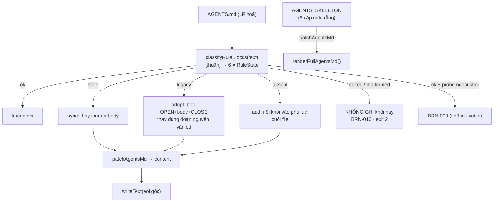

# 00-ARCHITECTURE — Vá Tất Định Bằng Khối Đánh Dấu Ẩn (#10)

## 1. Vấn đề (mọi con số đo 2026-09-02, lệnh tái lập trong TESTING-ACCEPTANCE §5)

Engine `init_brain.js` (1447 dòng) vá `AGENTS.md` của 66 repo bằng cách **đoán** vị trí luật: 4 nhánh `if (!includes(token))`, regex dò tiêu đề `### G.` / `### H.` / `## 📋 3.`, 3 nhánh fallback "phụ lục cuối file", và **hai bản sao** của mỗi thân luật (một trong `renderFullAgentsMd`, một trong `patchAgentsMd`). Hậu quả đã trả giá:

- **#07:** regex `\n` trượt trên file CRLF ⇒ nhánh CHÈN thay vì THAY ⇒ 33 repo có hai luật planning cùng sống.
- **#09:** tiêu đề phụ lục tự sinh chứa token ⇒ đếm token ra 2 ⇒ 15 báo động giả (gotcha #17), phải thay bằng đếm "mệnh đề" (`RULE_ANCHORS`, 24 dòng).
- **Đo mới (SPEC-writer):** template hardcode ví dụ `brain4agent-v1.2.0.md` trong luật root-marker còn bản vá nội suy `${version}` ⇒ hai bản sao **đã** lệch nhau. **10 repo** không hề có phát biểu Bước 0 nhưng vẫn "đạt chuẩn" vì token `xay-dung-nao-bo` xuất hiện ở luật J mục 4 — âm tính giả tiềm ẩn của cơ chế đếm chuỗi.
- **Chi phí thêm một luật:** ≈ 25 dòng mã (nhánh `if` + regex neo + fallback + log + token BRN-002 + mục `RULE_ANCHORS`) và một họ lỗi trượt mới.

Đồng thời khung v1.4.0 cần 2 luật đã chạy thật ở repo mẫu (tag `v1.18.0`): Ký ức Lạnh `memory/archive/` và Structural Extension.

## 2. Mục tiêu (Goals)

| # | Mục tiêu | Đo bằng |
| :-- | :--- | :--- |
| M1 | Vá `AGENTS.md` = **thay nội dung giữa hai mốc** cho 6 khối; ngoài mốc là lãnh địa người dùng, engine không chạm | Tiêu chí **A3** (01-CONTRACTS §10) = 0 dòng thay đổi ngoài vùng mốc trên F09 và trên fleet `--dry-run` |
| M2 | **Fail-closed**: 5 dạng mốc hỏng ⇒ khối đó 0 byte ghi, BRN-016 | 5/5 dạng có test đỏ-nếu-vi-phạm (TESTING-ACCEPTANCE §2) |
| M3 | Migration 1.3.0 → 1.4.0 **một chiều, một đường**, idempotent từ lần chạy 2 | **A1** byte-identical RUN2 ≡ RUN3 trên mọi fixture + fleet |
| M4 | Thân luật **một bản duy nhất**: `renderFullAgentsMd() === patchAgentsMd(AGENTS_SKELETON).content` | T-M18 |
| M5 | 2 luật v1.4.0 vào khung với **≤ 10 dòng engine mỗi luật** | G3 |
| M6 | Lõi vá teo ≥ 25%, engine ≤ 1472 dòng | G1, G2 |
| M7 | Doctor thấy được repo cần người: BRN-016 (marker hỏng/sửa tay), BRN-017 (file lạ archive) | T-R20/21 |

## 3. Non-goals — 14 VÙNG CẤM (đã cân nhắc, quyết định KHÔNG làm)

Agent thực thi **CẤM** "tiện tay làm luôn" bất kỳ mục nào. Mỗi mục kèm lý do để agent sau không "sửa lại cho tốt hơn".

| # | KHÔNG làm | Lý do |
| :-- | :--- | :--- |
| C1 | Attribute trong mốc (`v=`, `hash=`, `generated=`, timestamp) | Đ1: nguồn chân lý thứ ba; rewrite 6 mốc × 66 repo mỗi lần bump; phá A2/A3. Mốc là **định danh**, không phải metadata. |
| C2 | Một khối bọc cả file, hoặc bọc bảng §2 | Đ1: bảng §2 hub đã đo khác template ⇒ xoá tuỳ biến 66 repo hoặc không bao giờ hội tụ. |
| C3 | Coi EOF là biên đóng khi thiếu mốc đóng; hoặc "chọn mốc đầu tiên" khi có ≥2 | Đ2: thiệt hại lớn nhất toàn kế hoạch. |
| C4 | Cờ `--force` / `--adopt` / `--overwrite` để ép hội tụ repo đã sửa tay | Đ3: tính năng ngoài scope, súng chĩa vào 66 repo. Cách xử tay đủ: người xoá/bọc lại đoạn đã sửa rồi chạy lại. |
| C5 | Regex trên văn xuôi trong lớp vá, ngoài **một** mẫu lỗ SemVer `\d+\.\d+\.\d+` ghép giữa các đoạn đã escape | Mọi regex trên văn xuôi là một đường trượt mới. |
| C6 | Tiêu đề phụ lục tự sinh chứa bất kỳ `probe`/`token` nào | Gotcha #17. Có test T-M19. |
| C7 | Marker trong `memory-distill.txt`, `CLAUDE.md`, `CORE_GOVERNANCE_RULES.md` | Ngoài scope; thêm mã chứ không bớt; `patchDistill` giữ nguyên. |
| C8 | Mã "chèn hàng vào bảng markdown" cho repo cũ | Đ6.2: dò cấu trúc — đúng thứ #10 khai tử. Repo cũ nhận luật Ký ức Lạnh dạng văn xuôi trong khối. |
| C9 | Cắt `--dry-run` / `renderDiff` để đạt chỉ tiêu dòng | Thiết bị an toàn của đợt ghi 66 repo. |
| C10 | Đặt mốc bên trong bảng GFM hoặc bên trong khối ``` ``` ``` | Vỡ bảng / bắt nhầm ví dụ. |
| C11 | Dual-path: giữ regex cũ làm fallback cạnh marker | Đ8.2: test cũ xanh 100% mà không phủ đường mới. Đường cũ **không tồn tại** ở bất kỳ dạng nào (kể cả bước migration — migration là khớp NGUYÊN VĂN, không regex). |
| C12 | Ký tự sentinel thô (NUL, U+FFFF…) trong mã nguồn để đánh dấu lỗ version | Đ7: git coi file là nhị phân. |
| C13 | Đưa script xoay ký ức (`rotate_hot_memory.py`), hook, `.claude/settings.json`, `.gitkeep` vào khung | Scope brief: khung chỉ hợp thức hoá chỗ chứa + luật ghi. |
| C14 | Ghi tên repo vệ tinh / đường dẫn máy / bản đồ vị trí vào file tracked; push; ghi hàng loạt khi user chưa ra lệnh | Repo PUBLIC (A9). Đ10. |

## 4. Bất biến kiến trúc của #10 (không SPEC nào được vượt)

Kế thừa toàn bộ A1–A11 của #09 (trừ A8 "template không đổi" — hết hiệu lực vì #10 bump template). Thêm:

| ID | Bất biến | Kiểm bằng |
| :-- | :--- | :--- |
| M-1 | **Mốc so khớp theo DÒNG** trên văn bản LF: `lines[i] === OPEN(id)`. Không `indexOf`, không regex trên mốc. | T-M08 (mốc thụt lề / trong ``` không được nhận) |
| M-2 | **Fail-closed từng khối**: `malformed` ⇒ khối đó không ghi; khối khác vẫn xử lý. | T-M03..07, T-M16 |
| M-3 | **Engine chỉ bọc mốc quanh văn bản CHÍNH NÓ từng viết** (khớp nguyên văn `legacy`). Không suy diễn vị trí từ tiêu đề. | T-M12, T-M24 (oracle viết tay) |
| M-4 | **Có dấu vết mà không khớp nguyên văn ⇒ không ghi, không chèn** (BRN-016). | T-M15, T-C31 |
| M-5 | **Thân luật một bản**: `renderFullAgentsMd() === patchAgentsMd(AGENTS_SKELETON).content`; skeleton có đúng 6 cặp mốc rỗng. | T-M18 |
| M-6 | **Thân luật không chứa version** (`/\d+\.\d+\.\d+/` không khớp bất kỳ `body`). | T-M20 |
| M-7 | **Khối độc lập vị trí**: người dùng được di chuyển trọn khối (cả 2 mốc) tới bất kỳ đâu trong file; engine không phân biệt. | T-M13 (khối ở đầu/cuối file đều `sync` đúng) |
| M-8 | **Một vòng lặp, một bảng dữ liệu**: thêm luật thứ 7 = thêm một phần tử `RULE_BLOCKS` + thân luật, **0 nhánh mã mới**. | G3; T-H02e bánh cóc `RULE_BLOCKS.length === 6` |
| M-9 | **Chẩn đoán và vá dùng chung một hàm phân loại** `classifyRuleBlocks` — không có hai định nghĩa "thế nào là thiếu luật". | T-M11 + grep: `includes('SPEC PACKAGE')` = 0 trong engine ngoài `RULE_BLOCKS` |
| M-10 | **0 byte điều khiển** (ngoài `\t`, `\n`) trong engine và doctor. | T-M22 |

## 5. Sơ đồ



## 6. Router thứ tự đọc

1. File này.
2. `01-CONTRACTS.md` — **đọc trọn**; §2 (fail-closed) là luật quan trọng nhất của cả kế hoạch.
3. `OPERATIONS.md` §1 — thứ tự WP.
4. SPEC theo thứ tự thực thi: `SPEC-P01` → `SPEC-P02` → `SPEC-P03` → `SPEC-P04` → `SPEC-P05` → `SPEC-P06`.
5. `TESTING-ACCEPTANCE.md` — khi viết test và khi đóng; §4 là ba gate Đ5.

## 7. Rủi ro và đối sách

| Rủi ro | Đối sách |
| :--- | :--- |
| Mốc đóng bị xoá ⇒ ghi đè đuôi file | M-2 + 5 test dạng hỏng + `findBlock` không có nhánh EOF (review bắt buộc dòng-từng-dòng ở P01) |
| Không khớp nguyên văn ⇒ chèn bản thứ hai (tái diễn #07) | M-4 (`probe`); đo thật fleet: 5 repo sẽ rơi vào BRN-016 thay vì bị chèn |
| Golden hợp thức hoá bug bọc mốc | Đ8.3: test đơn vị + oracle viết tay (T-M24) TRƯỚC; golden SAU; orchestrator dựng bộ so sánh riêng |
| `LAW_TOKENS` tĩnh xanh giả | Đ8.1: đọc `RULE_BLOCKS[].token` từ engine + so `inner === body` 6/6 khối hub |
| CRLF trượt | So khớp sau `normalizeEol`; T-C34 trên F05 (100% CRLF sau ghi, idempotent) |
| Ghi 66 repo không bằng chứng | OPERATIONS §5: `git status` sạch từng repo, `--dry-run` 100% trước, sóng hub → repo mẫu → 3 canary → còn lại, mỗi sóng A1–A4 |
| Overengineering | G1/G2/G3 có số trước/sau; vượt ⇒ DỪNG |
