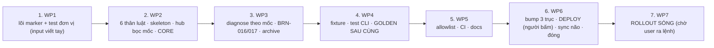

# OPERATIONS — Thứ Tự, Nhánh/Commit, Deploy, Sóng Rollout, Rollback, Người Bấm Nút (#10)

---

## §1. THỨ TỰ BẮT BUỘC GIỮA CÁC WP

| Bước | Vì sao phải đứng ở đây |
| :-- | :--- |
| 1 | Test đơn vị hành vi marker phải xanh **trước** mọi thứ khác (Đ8.3) và phải dựa trên **input viết tay** — nếu viết sau khi có fixture/golden mới, test sẽ vô thức chép kỳ vọng từ đầu ra engine. Bước đầu của WP1 là **xoá** `patch-agents.test.js` và ghi lại lượt chạy đỏ (Đ8.2). |
| 2 | Skeleton (đòn bẩy Đ5) cần `patchAgentsMd` mới. Hub phải S2 trong cùng commit, nếu không T-H02d và `self-check` đỏ kéo dài. |
| 3 | `diagnose` dùng `classifyRuleBlocks` (WP1) và cần đủ 6 khối (WP2) để định nghĩa BRN-002. |
| 4 | Golden chỉ có nghĩa khi engine đã **đủ** (WP1–3). Chụp sớm = chụp lại lần hai = hợp thức hoá. |
| 5 | Việc nhỏ đụng `ci.yml`/allowlist — làm sau khi engine ổn định để đo số allowlist một lần. |
| 6 | Deploy chỉ khi `npm test` xanh local **và** CI xanh 2 OS (remote — cần user cho push nhánh). Bước đầu tiên chạm ngoài repo hub ⇒ người bấm nút. |
| 7 | Repo vệ tinh gọi bản **global** ở Bước 0 ⇒ rollout chỉ sau deploy + verify. Chờ user ra lệnh (Đ10). |

**Cấm song song:** WP1–WP4 đụng chung engine/tests — tuần tự tuyệt đối. WP5 có thể song song với WP4 nếu khác agent và không chạm `tests/hygiene/no-abs-path.test.js` cùng lúc.

## §2. TIỀN KIỂM ĐẦU MỖI PHIÊN

1. `git status` sạch; `git log -3`; `grep BRAIN_TEMPLATE_VERSION init_brain.js` = `1.3.0` (trước WP6) — nếu khác, DỪNG: kế hoạch giả định xuất phát 1.3.0/1.6.0/`dd7967e`.
2. `node --version` ≥ 24; `pwsh --version` ≥ 7.
3. `npm test` xanh ở HEAD (hoặc đỏ đúng danh sách đã ghi ở `plan.md` nếu đang giữa WP1–WP4).
4. `npm run deploy:verify`: trước WP6 kỳ vọng **0** (global = hub v1.6.0); sau WP6 kỳ vọng 0 với bản 1.7.0.

## §3. NHÁNH VÀ COMMIT

- Làm trên nhánh `feat/plan-10-marker` (không commit thẳng `main` khi lưới đang đỏ giữa WP1–WP4).
- Mỗi WP ≥ 1 commit riêng, tiếng Anh, Conventional Commits; không trộn WP (để `git revert` theo WP).
- Merge fast-forward vào `main` **chỉ khi** mọi gate local ✅ (TESTING-ACCEPTANCE §6). Push nhánh/`main` **chờ user ra lệnh**.
- **Không push** `backup/pre-redact-2026-09-02`, `refs/original/`.

## §4. DEPLOY GLOBAL (WP6) — người bấm nút

| # | Việc | Kiểm | Ai |
| :-- | :--- | :--- | :-- |
| D1 | Bump 3 trục: `ENGINE_VERSION=1.7.0`, `package.json=1.7.0`, `BRAIN_TEMPLATE_VERSION=1.4.0`; chạy engine **chế độ ghi trên hub** (được phép: hub) ⇒ `state.json` 1.4.0/1.7.0, marker `brain4agent-v1.4.0.md` | `version-sync` xanh; `--check .` = 0 | agent |
| D2 | Backup thư mục skill global + thư mục lệnh vào scratchpad (đường dẫn ghi `today.md`, không ghi SPEC) | | agent |
| D3 | `npm run deploy:verify` ⇒ kỳ vọng exit 2 (`DIFF init_brain.js`, có thể `DIFF brain_doctor.js`, `DIFF SKILL.md`) | dán `SUMMARY` vào TESTING-ACCEPTANCE §5 | agent |
| D4 | **Xin phép user bằng lời**: "sắp ghi bản engine 1.7.0 / khung 1.4.0 ra global — mọi repo chạy Bước 0 sau đó sẽ thấy `CẦN NÂNG CẤP`" | | **user** |
| D5 | `npm run deploy` ⇒ exit 0, `diff=0 missing=0 cmd=ok` | | agent |
| D6 | Kiểm tay: hash từng file; `node <global>/init_brain.js --version` = `brain-engine 1.7.0 template 1.4.0`; `node <global>/init_brain.js --check <hub>` = 0 | | agent |
| D7 | Doctor quét kho **chỉ đọc** từ bản global (`--json` vào scratchpad): kỳ vọng 65 repo BRN-002 (template 1.3.0 ≠ 1.4.0, + khối vắng) và **5** BRN-016; ghi số đếm | bảng đếm vào TESTING-ACCEPTANCE §5 | agent (**user cho phép** đọc kho) |

Sau D5, **mọi repo vệ tinh** chạy Bước 0 (bản cũ, chế độ ghi) sẽ được engine 1.7.0 vá ngay — đây chính là lý do rollout phải diễn ra sớm sau deploy và có kiểm soát (§5), và là lý do D4 phải nói rõ với user.

## §5. ROLLOUT FLEET (WP7) — CHỜ USER RA LỆNH, theo sóng, mỗi sóng một cổng

### 5.1 Điều kiện tiên quyết cho MỖI repo (kịch bản, không phải engine)
1. `git -C <repo> status --porcelain` **rỗng** (kể cả untracked). Không sạch ⇒ **BỎ QUA**, ghi danh sách (số đếm) — không stage hộ, không stash (bài học #06).
2. `--dry-run` trước: lưu output ở scratchpad; chạy `diff-scope` trên bản sao `AGENTS.md` trước/sau (không ghi repo).
3. Repo có BRN-016 ⇒ **LOẠI khỏi đợt tự động**; xử tay (§5.4).
4. Sau ghi: chạy engine **lần 2** ngay ⇒ phải `NÃO ĐÃ OK`, exit 0, `AGENTS.md` sha không đổi (A1 tại chỗ).
5. Commit trong repo vệ tinh: `chore(brain): migrate AGENTS.md to marker blocks (template 1.4.0)` — **không push**.

### 5.2 Sóng

| Sóng | Phạm vi | Cổng để sang sóng sau |
| :-- | :--- | :--- |
| **0** | `--dry-run` 100% repo 1.3.0 (65) + doctor chỉ đọc | bảng phân bố S1–S5 khớp SPEC-P02 §2 (±0 — nếu lệch phải giải thích từng repo); tổng vi phạm A2/A3 = 0 |
| **1** | **hub** | diff `AGENTS.md` = 0 ngay lần đầu; `--check` = 0 |
| **2** | **repo mẫu** (đã có nội dung 1.4.0) | 4 khối `adopt`, `cold-memory` `add`, `structural-extension` BRN-016 ⇒ **xử tay** (thay mục 2 §5.B bằng khối); chạy lại ⇒ 0; diff lần 2 = 0 |
| **3** | **3 canary** chọn có chủ đích: (a) repo **CRLF** duy nhất; (b) 1 trong 4 repo `boot` sửa tay (đường BRN-016 → xử tay → hội tụ); (c) 1 repo `boot` vắng (đường `add`) | mỗi repo: A1 ✅, A2/A3 = 0, `AGENTS.md` render đúng trên GitHub/VS Code preview (mở bằng mắt) |
| **4** | phần còn lại của 60 repo tự động (theo lô 10, `dry-run` lại ngay trước ghi vì kho có thể đổi) | sau mỗi lô: doctor chỉ đọc, số CLEAN tăng đúng số lô |
| **5** | 4 repo BRN-016 còn lại — **xử tay từng cái** | 0 BRN-016 trên fleet (hoặc user quyết định để lại, ghi rõ) |

2 repo ngoại lệ (1.2.0, null): **không chạm** (Đ10).

### 5.3 Bằng chứng mỗi sóng (chỉ số đếm vào TESTING-ACCEPTANCE §5)
số repo ghi / bỏ qua vì bẩn / BRN-016 / A2 vi phạm / A3 vi phạm / thời gian; doctor trước–sau (`clean/warning/error`).

### 5.4 Xử tay BRN-016 (không cờ ép — Đ3)
`edited`: mở `AGENTS.md`, xoá đoạn luật đã sửa (hoặc dán 2 dòng mốc quanh nó), chạy engine chế độ ghi, chạy lần 2 ⇒ 0. `malformed`: sửa mốc. Ghi số đếm, không ghi tên.

## §6. ROLLBACK

| Phạm vi | Cách |
| :--- | :--- |
| WP1–WP5 (chỉ trong hub) | `git revert` theo commit WP (ngược thứ tự). Golden/fixture theo commit WP4. |
| WP6 deploy (ngoài git) | như #09 OPERATIONS §5-WP3: dừng phiên agent khác; chép lại backup D2 vào global; hash tay; `node <global>/init_brain.js --version` = `1.6.0 template 1.3.0`; revert commit bump trong hub |
| Một repo vệ tinh sau ghi | `git -C <repo> checkout -- AGENTS.md brain4agent/memory/hot/state.json` + xoá marker `v1.4.0.md`, khôi phục `v1.3.0.md` (`git checkout --`), xoá `memory/archive/` nếu rỗng — đủ vì điều kiện 5.1.1 (repo sạch trước ghi); hoặc `git revert` commit 5.1.5 nếu đã commit |
| Cả sóng | lặp dòng trên theo danh sách sóng; doctor chỉ đọc xác nhận về 1.3.0 |
| Actions v5 lỗi | sửa 2 dòng về `@v4`, commit riêng |

Nguyên tắc: **không** `reset --hard` trên nhánh có việc của người khác; **không** chạy engine cũ để "vá ngược" (engine không có chế độ hạ version).

## §7. ĐÓNG KẾ HOẠCH — SYNC CASCADE 6 ĐIỂM (luật §5.B) + việc kèm

| # | Việc | File |
| :-- | :--- | :--- |
| 1 | Docs module (SPEC-P06 §4) | `docs/xay-dung-nao-bo.md` |
| 2 | `index.md`: marker `v1.4.0`, thêm `tests/unit/marker.test.js`, `tests/helpers/diff-scope.js`, `tests/hygiene/abs-path-allowlist.json`, fixture F09/F10/`fleet/03` | `brain4agent/index.md` |
| 3 | `roadmap.md`: #10 → Done; Idea Vault: `supersedes` (TQ5), đổi mặc định CLI sang `--check` (MAJOR), template distill nhắc `--check`, test canh version README, hợp nhất 2 hiến pháp (#11) | `brain4agent/roadmap.md` |
| 4 | `changelog.md`: `[v1.7.0]` — Added (marker, BRN-016/017, archive, F09/F10), Changed (BRN-002/003, thân `boot`/`root-marker`, template 1.4.0, allowlist JSON, actions v5), Removed (regex neo, `AGENTS_PATCH_LOGS`, `RULE_ANCHORS`) | `brain4agent/changelog.md` |
| 5 | `today.md` + `state.json` (`current_version: 1.7.0`, `brain_template_version: 1.4.0`, số đếm rollout, `engine_source_vs_global_deploy`) | `brain4agent/memory/hot/` |
| 6 | `memory-distill.txt`: 2–3 dòng (6 khối marker, fail-closed, BRN-016 = cần người, Bước 0 `--check`) — < 100 dòng | `brain4agent/memory-distill.txt` |
| 7 | Gotchas mới: "mốc phải trọn dòng — thụt lề là vô hình với engine", "10 repo pass BRN-002 giả nhờ luật J.4 (đếm chuỗi)", "template hardcode ví dụ version ≠ bản vá" | `brain4agent/-known-gotchas.md` |
| 8 | `plan.md`: `✅ ĐÃ HOÀN THÀNH` + giờ đến giây; G1/G2/G3 điền số; Exit Gates | `planning/10_*/plan.md` |
| 9 | Đề xuất commit (tiếng Anh) — **không push** | |

Nếu user **hoãn** WP7: ghi vào nhật ký `plan.md` "rollout hoãn theo lệnh user, engine 1.7.0 đã deploy", cột `fleet` của Exit Gates để ⏸ — kế hoạch được đóng ở mức "engine + hub + global" (giống cách #09 để lại H6).

## §8. DANH SÁCH THAO TÁC BẮT BUỘC CÓ NGƯỜI BẤM NÚT

| # | Thao tác | Bước | Vì sao |
| :-- | :--- | :-- | :--- |
| H1 | Duyệt bộ SPEC (P00b) | 0 | luật §3 |
| H2 | Duyệt danh sách test đỏ sau khi xoá `patch-agents.test.js` (bằng chứng Đ8.2) | WP1 | đổi định nghĩa "đúng" |
| H3 | Duyệt fixture chụp lại + golden mới (đọc diff `manifest.json` từng case) | WP4 | đổi bằng chứng đối chứng |
| H4 | Cho phép **push** nhánh để CI chạy | WP5/6 | remote |
| H5 | **Deploy global** (D4) | WP6 | ghi ngoài repo, ảnh hưởng Bước 0 mọi repo |
| H6 | Cho phép doctor/dry-run **đọc** kho | WP6 D7, sóng 0 | kho private |
| H7 | **Ra lệnh rollout** từng sóng (1 → 5) | WP7 | ghi hàng loạt |
| H8 | Quyết định 5 repo BRN-016 và 2 repo ngoại lệ | sóng 5 | văn bản người dùng |
| H9 | `git push` hub `main` (nếu muốn) | đóng | remote |
| H10 | Đổi TQ1/TQ2/TQ3/TQ5 nếu không ưng (ghi `plan.md`) | bất kỳ | điểm user có thể muốn đổi |
